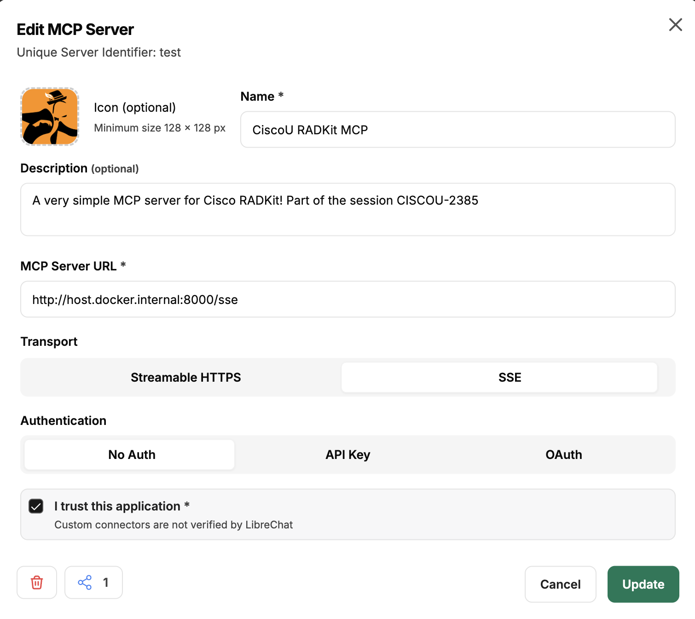

<h1 align="center">✨<strong>CISCOU-2385</strong>✨</br>Chatting With My Network via Cisco RADKit and FastMCP<br />

<div align="center">
  
  
  <a href="https://gofastmcp.com/getting-started/welcome"></a>
</div></h1>

<div align="center">
Demo code of the CiscoU-2385 session.<br /><br />
This is a <strong>stand-alone MCP server</strong> built with <a href="https://github.com/modelcontextprotocol/fastmcp"><strong>FastMCP</strong></a> that exposes key functionalities of the <a href="https://radkit.cisco.com/"><strong>Cisco RADKit</strong></a> SDK as MCP tools.  
</br>It is designed to be connected to any <strong>MCP client</strong> and <strong>LLM</strong> of your choice, enabling intelligent interaction with network devices through Cisco RADKit.
<br /><br />
</div>

> **⚠️ Disclaimer**: This MCP Server is not an official Cisco product. It was developed for learning purposes as part of Cisco U.

## 🚀 Overview

This MCP server acts as a lightweight middleware layer between the **Cisco RADKit** service and an **MCP-compatible client**.  
It allows the LLM to inspect and interact with devices onboarded in the RADKit inventory, fetch device attributes, and even execute CLI commands — all through structured MCP tools.

The following diagram shows how this MCP works with your favourite LLM and your Cisco RADKit onboarded network:

<div align="center">

</div></br>

> Only CLI operations are supported by this experimental MCP server

## 🧰 Exposed MCP Tools

| Tool Name | Description | Inputs | Returns | Use Case |
|------------|--------------|---------|----------|-----------|
| **`get_device_inventory_names()`** | Returns a string containing the names of devices onboarded in the Cisco RADKit inventory. | *None* | `str`: List of onboarded devices (e.g. `{"p0-2e", "p1-2e"}`) | Use this first when the user asks about "devices", "network", or "all devices". |
| **`get_device_attributes(target_device: str)`** | Returns detailed information about a specific device in JSON format. | `target_device (str)`: Target device name. | `str`: JSON with attributes including name, host, type, configs, SNMP/NETCONF status, capabilities, etc. | Use this when the user asks about a specific device. |
| **`exec_cli_command_in_device(target_device: str, cli_commands: [str])`** | Executes a CLI command on a target device and returns the raw text result. | `target_device (str)`: Device name.<br>`cli_commands ([str])`: CLI command to execute. | `str`: Raw output of the executed command. | Use this only if info is unavailable in `get_device_attributes()` or when explicitly asked to “run” or “execute” a command. |

## 🧩 Requirements

- Python 3.10+
- [uv Python package manager](https://docs.astral.sh/uv/)
- [Active Cisco RADKit service](https://radkit.cisco.com/#Start)
- At least one remote user onboarded in the Cisco RADKit service

## 🛠️ Installation

Clone the repository in your deployment environment.
```bash
git clone https://github.com/ponchotitlan/ciscou-2385-radkit-mcp
```
```bash
cd ciscou-2385-radkit-mcp
```

## ⚙️ Setup

Execute the included assistant script in a terminal:

```bash
uv sync
```

```bash
uv run ciscou-radkit-onboarding
```

The following assistant will be triggered:

```bash
╭─────────────────────────────────────────╮
│ 🚀 Cisco RADKit MCP Server Utility Tool │
╰─────────────────────────────────────────╯
? Choose an option: (Use arrow keys)
 » 1. 👾 Onboard user to non-interactive Cisco RADKit authentication
   2. 📚 Generate .env file for Cisco RADKit MCP server
   Exit
```

### 👾 1. Non-interactive Cisco RADKit authentication setup

The MCP server makes use of certificate login to avoid asking for Web UI authentication every time a tool is used. For that, the certificates need to be generated in the host. Select the first option and follow the instructions.

```bash
╭─────────────────────────────────────────╮
│ 🚀 Cisco RADKit MCP Server Utility Tool │
╰─────────────────────────────────────────╯
? Choose an option: 1. 👾 Onboard user to non-interactive Cisco RADKit authentication
? Enter Cisco RADKit username: ponchotitlan@cisco.com
╭───────────────────────────────────────────────────────────────────╮
│ Starting Cisco RADKit onboarding for user: ponchotitlan@cisco.com │
╰───────────────────────────────────────────────────────────────────╯

A browser window was opened to continue the authentication process. Please follow the instructions there.

Authentication result received.
New private key password: ***********
Confirm: ***********
The private key is a very sensitive piece of information. DO NOT SHARE UNDER ANY CIRCUMSTANCES, and use a very strong passphrase. Please consult the documentation for more details.
<frozen radkit_client.async_.client>:891: UserWarning: The private key is a very sensitive piece of information. DO NOT SHARE UNDER ANY CIRCUMSTANCES, and use a very strong passphrase. Please consult the documentation for more details.
```
**Take note of the password provided, as it will be needed for the 2nd option!**</br>
Now, select the second option:

### 📚 2. Generate .env file

Provide the information requested. The password is the one just setup in the first option.

```bash
? Choose an option: 2. 📚 Generate .env file for Cisco RADKit MCP server
╭───────────────────────────────────────────────────────────────────────────────╮
│ Warning: Make sure Cisco RADKit certificates for this username already exist. │
│ If not, run the onboarding process first using option 1.                      │
╰───────────────────────────────────────────────────────────────────────────────╯
? Enter Cisco RADKit username: ponchotitlan@cisco.com
? Enter Cisco RADKit service code: aaaa-bbbb-cccc
? Enter non-interactive authentication password: ***********
╭──────────────────────────────────────╮
│ ✅ .env file generated successfully! │
│ Saved as .env                        │
╰──────────────────────────────────────╯
```

The file **.env** is generated with environment variables that the MCP Server needs.</br></br>
✅ **Your MCP server is ready for use!**

To run it, simply use the following command in your terminal:

```bash
uv run ciscou-radkit-mcp
```

You should see the following screen. The URL will change depending on the kind of transport that you setup in your `.env` file (stdio, http, sse):

```bash
2026-01-06 08:43:21,374 - ciscou_radkit_mcp.radkit_mcp_server - INFO - Starting MCP server with sse transport on 0.0.0.0:8000


                                  ╭──────────────────────────────────────────────────────────────────────────────╮                                   
                                  │                                                                              │                                   
                                  │                         ▄▀▀ ▄▀█ █▀▀ ▀█▀ █▀▄▀█ █▀▀ █▀█                        │                                   
                                  │                         █▀  █▀█ ▄▄█  █  █ ▀ █ █▄▄ █▀▀                        │                                   
                                  │                                                                              │                                   
                                  │                                FastMCP 2.13.1                                │                                   
                                  │                                                                              │                                   
                                  │                                                                              │                                   
                                  │                   🖥  Server name: CiscoURADKitMCP                            │                                   
                                  │                                                                              │                                   
                                  │                   📦 Transport:   SSE                                        │                                   
                                  │                   🔗 Server URL:  http://0.0.0.0:8000/sse                    │                                   
                                  │                                                                              │                                   
                                  │                   📚 Docs:        https://gofastmcp.com                      │                                   
                                  │                   🚀 Hosting:     https://fastmcp.cloud                      │                                   
                                  │                                                                              │                                   
                                  ╰──────────────────────────────────────────────────────────────────────────────╯                                   


[01/06/26 08:43:21] INFO     Starting MCP server 'CiscoURADKitMCP' with transport 'sse' on http://0.0.0.0:8000/sse                     server.py:2055
INFO:     Started server process [55969]
INFO:     Waiting for application startup.
INFO:     Application startup complete.
INFO:     Uvicorn running on http://0.0.0.0:8000 (Press CTRL+C to quit)
INFO:     127.0.0.1:54860 - "GET /sse HTTP/1.1" 200 OK
```

## ⚡️ Usage example: LibreChat app

LibreChat is an open-source app for all your AI conversations, fully customizable and compatible with any AI provider and MCP server, including ours.</br>
For this demo, we will use the [Docker version](https://www.librechat.ai/docs/local/docker) of this app for a local deployment.

> You need to have Docker installed in your host environment to run this deployment.

To get started, clone the repository in your environment and copy the default `.env` file provided:

```bash
git clone https://github.com/danny-avila/LibreChat.git
```

```bash
cd LibreChat
```

```bash
cp .env.example .env
```

Now, copy the files `librechat.yaml` and `docker-compose.override.yml` located in the folder `librechat_setup` of this repository into the root directory of the LibreChat repository. This will allow us to onboard our local MCP server once the LibreChat app is started.

Finally, spin all the containers using the following command:

```bash
docker compose up -d
```

Once ready, login to the LibreChat app in your browser using the URL `http://localhost:3080/`. After creating an account, on the main page navigate to the left side and click the **+** button next to the banner that reads *Filter MCP servers by name*.

Afterwards, execute your MCP server **in SSE transport mode** and fill all the information requested.

> Very important! The URL of your MCP server shall be `http://host.docker.internal:8000/sse`, provided that LibreChat is on a container environment.

<div align="center">

</div></br>

Once the connection is successful, the MCP server will be available for your chats and requests!

<div align="center">

</div></br>
<div align="center">

</div></br>
<div align="center">

</div></br>
<div align="center">

</div></br>
<div align="center">

</div></br>

---

<div align="center"><br />
    Made with ☕️ by Poncho Sandoval - <code>Developer Advocate 🥑 @ DevNet - Cisco Systems 🇵🇹</code><br /><br />
    <a href="mailto:alfsando@cisco.com?subject=Question%20about%20[RADKIT%20MCP]&body=Hello,%0A%0AI%20have%20a%20question%20regarding%20your%20project.%0A%0AThanks!">
        
    </a>
    <a href="https://github.com/ponchotitlan/ciscou-2385-radkit-mcp/issues/new">
      
    </a>
    <a href="https://github.com/ponchotitlan/ciscou-2385-radkit-mcp/fork">
      
    </a>
</div>
