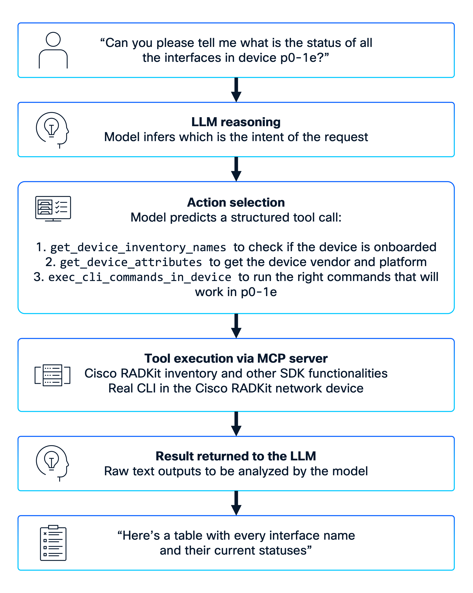
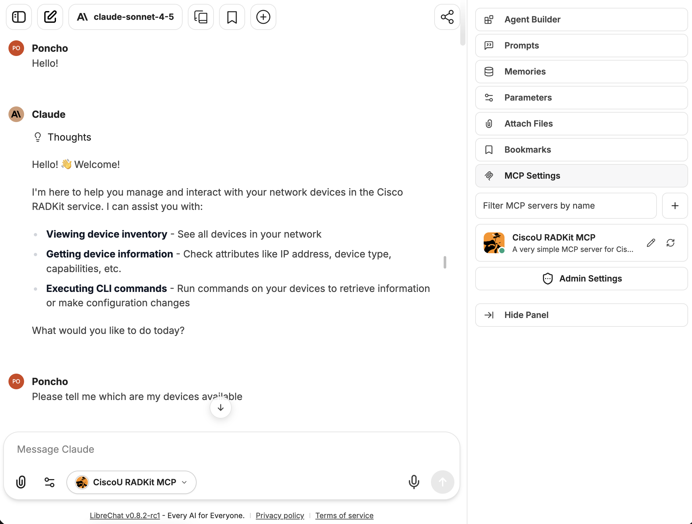
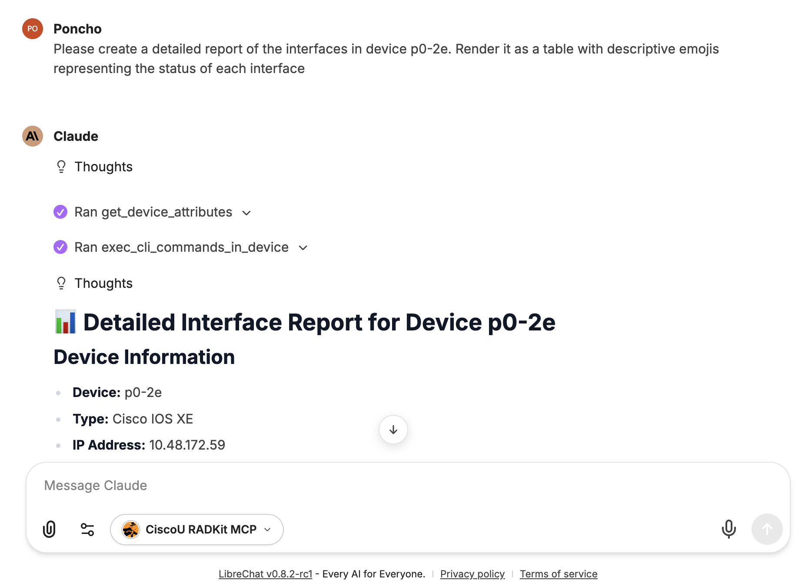
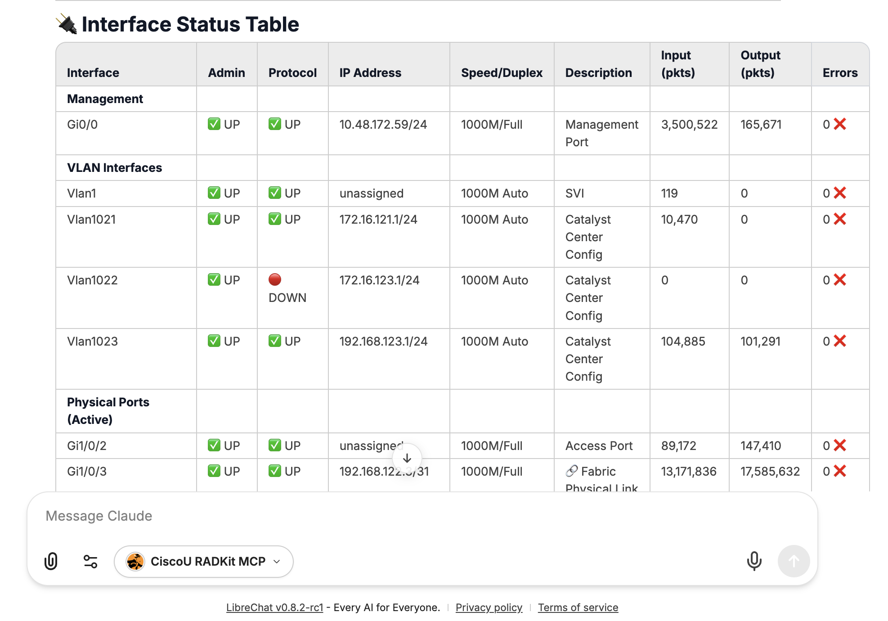
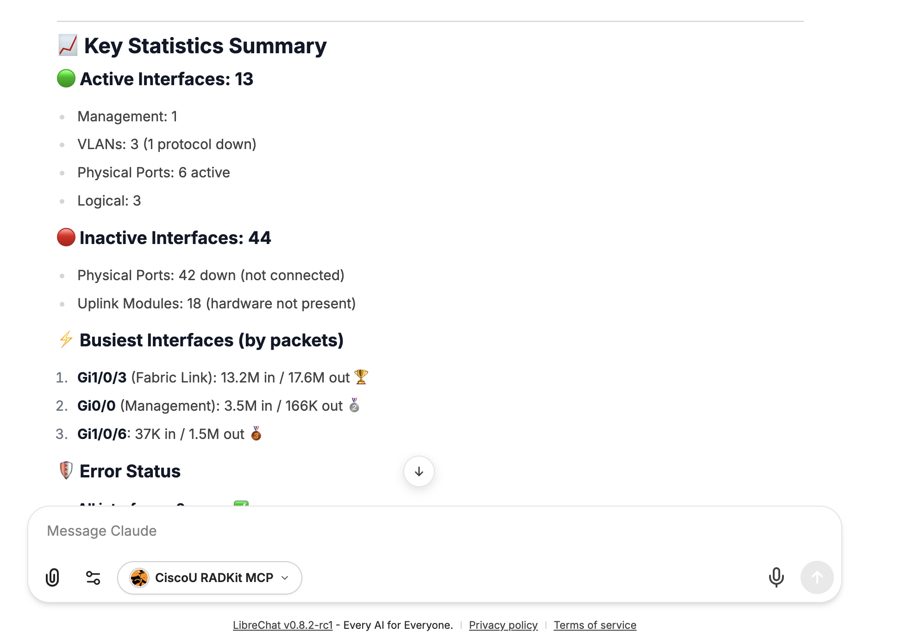
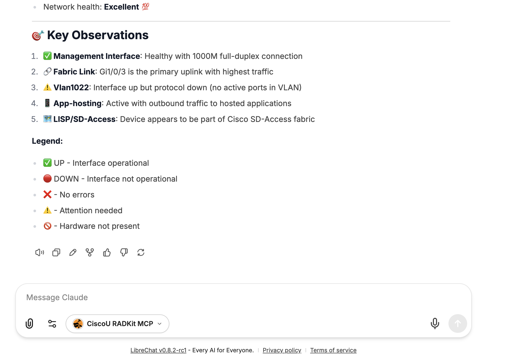

<h1 align="center">✨<strong>CISCOU-2385</strong>✨</br>Chatting With My Network via Cisco RADKit and FastMCP<br />

<div align="center">
  
  
  <a href="https://gofastmcp.com/getting-started/welcome"></a>
</div></h1>

<div align="center">
Demo code of the CiscoU-2385 session.<br /><br />
This is a <strong>stand-alone MCP server</strong> built with <a href="https://github.com/modelcontextprotocol/fastmcp"><strong>FastMCP</strong></a> that exposes key functionalities of the <a href="https://radkit.cisco.com/"><strong>Cisco RADKit</strong></a> SDK as MCP tools.  
</br>It is designed to be connected to any <strong>MCP client</strong> and <strong>LLM</strong> of your choice, enabling intelligent interaction with network devices through Cisco RADKit.
<br /><br />
</div>

> **⚠️ Disclaimer**: This MCP Server is not an official Cisco product. It was developed for learning purposes as part of Cisco U.

## 🚀 Overview

This MCP server acts as a lightweight middleware layer between the **Cisco RADKit** service and an **MCP-compatible client**.  
It allows the LLM to inspect and interact with devices onboarded in the RADKit inventory, fetch device attributes, and even execute CLI commands — all through structured MCP tools.

The following diagram shows how this MCP works with your favourite LLM and your Cisco RADKit onboarded network:

<div align="center">

</div></br>

> Only CLI operations are supported by this experimental MCP server

## 🧰 Exposed MCP Tools

| Tool Name | Description | Inputs | Returns | Use Case |
|------------|--------------|---------|----------|-----------|
| **`get_device_inventory_names()`** | Returns a string containing the names of devices onboarded in the Cisco RADKit inventory. | *None* | `str`: List of onboarded devices (e.g. `{"p0-2e", "p1-2e"}`) | Use this first when the user asks about "devices", "network", or "all devices". |
| **`get_device_attributes(target_device: str)`** | Returns detailed information about a specific device in JSON format. | `target_device (str)`: Target device name. | `str`: JSON with attributes including name, host, type, configs, SNMP/NETCONF status, capabilities, etc. | Use this when the user asks about a specific device. |
| **`exec_cli_command_in_device(target_device: str, cli_commands: [str])`** | Executes a CLI command on a target device and returns the raw text result. | `target_device (str)`: Device name.<br>`cli_commands ([str])`: CLI command to execute. | `str`: Raw output of the executed command. | Use this only if info is unavailable in `get_device_attributes()` or when explicitly asked to “run” or “execute” a command. |

## 🧩 Requirements

- Python 3.10+
- [uv Python package manager](https://docs.astral.sh/uv/)
- [Active Cisco RADKit service](https://radkit.cisco.com/#Start)
- At least one remote user onboarded in the Cisco RADKit service

## 🛠️ Installation

Clone the repository in your deployment environment.
```bash
git clone https://github.com/ponchotitlan/ciscou-2385-radkit-mcp
```
```bash
cd ciscou-2385-radkit-mcp
```

## ⚙️ Setup

Execute the included assistant script in a terminal:

```bash
uv sync
```

```bash
uv run ciscou-radkit-onboarding
```

The following assistant will be triggered:

```bash
╭─────────────────────────────────────────╮
│ 🚀 Cisco RADKit MCP Server Utility Tool │
╰─────────────────────────────────────────╯
? Choose an option: (Use arrow keys)
 » 1. 👾 Onboard user to non-interactive Cisco RADKit authentication
   2. 📚 Generate .env file for Cisco RADKit MCP server
   Exit
```

### 👾 1. Non-interactive Cisco RADKit authentication setup

The MCP server makes use of certificate login to avoid asking for Web UI authentication every time a tool is used. For that, the certificates need to be generated in the host. Select the first option and follow the instructions.

```bash
╭─────────────────────────────────────────╮
│ 🚀 Cisco RADKit MCP Server Utility Tool │
╰─────────────────────────────────────────╯
? Choose an option: 1. 👾 Onboard user to non-interactive Cisco RADKit authentication
? Enter Cisco RADKit username: ponchotitlan@cisco.com
╭───────────────────────────────────────────────────────────────────╮
│ Starting Cisco RADKit onboarding for user: ponchotitlan@cisco.com │
╰───────────────────────────────────────────────────────────────────╯

A browser window was opened to continue the authentication process. Please follow the instructions there.

Authentication result received.
New private key password: ***********
Confirm: ***********
The private key is a very sensitive piece of information. DO NOT SHARE UNDER ANY CIRCUMSTANCES, and use a very strong passphrase. Please consult the documentation for more details.
<frozen radkit_client.async_.client>:891: UserWarning: The private key is a very sensitive piece of information. DO NOT SHARE UNDER ANY CIRCUMSTANCES, and use a very strong passphrase. Please consult the documentation for more details.
```
**Take note of the password provided, as it will be needed for the 2nd option!**</br>
Now, select the second option:

### 📚 2. Generate .env file

Provide the information requested. The password is the one just setup in the first option.

```bash
? Choose an option: 2. 📚 Generate .env file for Cisco RADKit MCP server
╭───────────────────────────────────────────────────────────────────────────────╮
│ Warning: Make sure Cisco RADKit certificates for this username already exist. │
│ If not, run the onboarding process first using option 1.                      │
╰───────────────────────────────────────────────────────────────────────────────╯
? Enter Cisco RADKit username: ponchotitlan@cisco.com
? Enter Cisco RADKit service code: aaaa-bbbb-cccc
? Enter non-interactive authentication password: ***********
╭──────────────────────────────────────╮
│ ✅ .env file generated successfully! │
│ Saved as .env                        │
╰──────────────────────────────────────╯
```

The file **.env** is generated with environment variables that the MCP Server needs.</br></br>
✅ **Your MCP server is ready for use!**

To run it, simply use the following command in your terminal:

```bash
uv run ciscou-radkit-mcp
```

You should see the following screen. The URL will change depending on the kind of transport that you setup in your `.env` file (stdio, http, sse):

```bash
2026-01-06 08:43:21,374 - ciscou_radkit_mcp.radkit_mcp_server - INFO - Starting MCP server with sse transport on 0.0.0.0:8000


                                  ╭──────────────────────────────────────────────────────────────────────────────╮                                   
                                  │                                                                              │                                   
                                  │                         ▄▀▀ ▄▀█ █▀▀ ▀█▀ █▀▄▀█ █▀▀ █▀█                        │                                   
                                  │                         █▀  █▀█ ▄▄█  █  █ ▀ █ █▄▄ █▀▀                        │                                   
                                  │                                                                              │                                   
                                  │                                FastMCP 2.13.1                                │                                   
                                  │                                                                              │                                   
                                  │                                                                              │                                   
                                  │                   🖥  Server name: CiscoURADKitMCP                            │                                   
                                  │                                                                              │                                   
                                  │                   📦 Transport:   SSE                                        │                                   
                                  │                   🔗 Server URL:  http://0.0.0.0:8000/sse                    │                                   
                                  │                                                                              │                                   
                                  │                   📚 Docs:        https://gofastmcp.com                      │                                   
                                  │                   🚀 Hosting:     https://fastmcp.cloud                      │                                   
                                  │                                                                              │                                   
                                  ╰──────────────────────────────────────────────────────────────────────────────╯                                   


[01/06/26 08:43:21] INFO     Starting MCP server 'CiscoURADKitMCP' with transport 'sse' on http://0.0.0.0:8000/sse                     server.py:2055
INFO:     Started server process [55969]
INFO:     Waiting for application startup.
INFO:     Application startup complete.
INFO:     Uvicorn running on http://0.0.0.0:8000 (Press CTRL+C to quit)
INFO:     127.0.0.1:54860 - "GET /sse HTTP/1.1" 200 OK
```

## ⚡️ Usage example: LibreChat app

LibreChat is an open-source app for all your AI conversations, fully customizable and compatible with any AI provider and MCP server, including ours.</br>
For this demo, we will use the [Docker version](https://www.librechat.ai/docs/local/docker) of this app for a local deployment.

> You need to have Docker installed in your host environment to run this deployment.

### Prerequisites

- Docker and Docker Compose installed
- LibreChat v0.7.0 or later
- CiscoU RADKit MCP Server running in SSE mode (configured in previous steps)

### Setup Steps

#### 1. Clone and Setup LibreChat

Clone the LibreChat repository and copy the default environment file:

```bash
git clone https://github.com/danny-avila/LibreChat.git
cd LibreChat
cp .env.example .env
```

#### 2. Configure LibreChat for RADKit MCP

Copy the pre-configured files from this repository into your LibreChat directory:

```bash
# From the ciscou-2385-radkit-mcp directory
# Replace /path/to/LibreChat with your actual LibreChat local repository path
cp librechat_setup/librechat.yaml /path/to/LibreChat/librechat.yaml
cp librechat_setup/docker-compose.override.yml /path/to/LibreChat/docker-compose.override.yml
```

> **Note**: The `librechat.yaml` file already includes the RADKit MCP server configuration at `http://host.docker.internal:8000/sse`

#### 3. Optional: Add Agent Persona Configuration

For an enhanced experience with a specialized Network Automation Assistant persona:

```bash
# Navigate to your LibreChat directory in your local repository
cd /path/to/LibreChat

# Create the agents directory
mkdir -p agents

# Copy the agent configuration from this repository
cp /path/to/ciscou-2385-radkit-mcp/librechat_setup/librechat-agent-config.yaml \
   ./agents/cisco-radkit-netops.yaml
```

The provided `docker-compose.override.yml` already includes the volume mount for the agents directory:

```yaml
services:
  api:
    volumes:
    - type: bind
      source: ./librechat.yaml
      target: /app/librechat.yaml
    - type: bind
      source: ./agents
      target: /app/agents
```

**Verify your directory structure:**

Your LibreChat directory should look like this before starting the containers:

```
LibreChat/
├── .env
├── librechat.yaml                    # RADKit MCP server config
├── docker-compose.override.yml       # Volume mounts configuration
├── agents/
│   └── cisco-radkit-netops.yaml     # Agent persona config
└── ... (other LibreChat files)
```

This agent configuration provides:
- Intelligent workflow guidance for network discovery and troubleshooting
- Optimized prompts for using RADKit MCP tools effectively
- Best practices for parallel device queries
- Safety-aware command execution

#### 4. Start LibreChat

Now start all containers using Docker Compose:

```bash
# From the LibreChat directory
docker compose up -d
```

**Verify the volumes are mounted correctly:**

```bash
# Check if the agent configuration is accessible in the container
docker exec librechat-api ls -la /app/agents/

# Expected output should show:
# cisco-radkit-netops.yaml

# View the agent configuration
docker exec librechat-api cat /app/agents/cisco-radkit-netops.yaml
```

#### 5. Start Your MCP Server

In a separate terminal, ensure your RADKit MCP server is running in SSE mode:

```bash
# From the ciscou-2385-radkit-mcp directory
# Make sure your .env has: MCP_TRANSPORT=sse
uv run ciscou-radkit-mcp
```

You should see output confirming SSE transport:

```bash
🔗 Server URL: http://0.0.0.0:8000/sse
```

#### 6. Connect MCP Server in LibreChat

1. Open LibreChat in your browser: `http://localhost:3080/`
2. Create an account and log in
3. Navigate to the left sidebar and click the **+** button next to *Filter MCP servers by name*
4. The MCP server should already be configured from the `librechat.yaml` file
5. Verify the connection is active (green indicator)

> **Important**: The MCP server URL in the configuration is `http://host.docker.internal:8000/sse` to allow the Docker container to access your host machine's MCP server.

### Usage Examples

Once connected, you can interact with your network devices through natural language.

**Example conversations:**

```
User: "Show me all my devices"
```

<div align="center">

</div></br>

```
User: "What are the details of device p0-2e?"
```

<div align="center">

</div></br>

```
User: "Check the interface status on p0-2e"
```

<div align="center">

</div></br>

```
User: "Show me the running config for all devices"
```

<div align="center">

</div></br>

<div align="center">

</div></br>

### Troubleshooting

**MCP server not connecting:**
- Verify the MCP server is running: `uv run ciscou-radkit-mcp`
- Check the server is using SSE transport on port 8000
- Ensure `MCP_TRANSPORT=sse` in your `.env` file
- **For Linux users**: `host.docker.internal` may not work. Use your host's IP address instead in `librechat.yaml`:
  ```yaml
  mcpServers:
    ciscou-radkit:
      url: http://192.168.1.XXX:8000/sse  # Replace with your host IP
  ```
- Find your host IP:
  ```bash
  # Linux
  ip addr show | grep "inet " | grep -v 127.0.0.1
  
  # macOS
  ipconfig getifaddr en0
  ```

**Agent not appearing:**
- Verify the agents directory was created and the file was copied **before** starting Docker Compose
- Check the container has the volume mounted: `docker exec librechat-api ls -la /app/agents/`
- Check LibreChat logs for configuration errors: `docker compose logs api | grep -i agent`
- If you added the agent after starting containers, restart LibreChat: `docker compose restart api`

**Volume mount issues:**
- Ensure `docker-compose.override.yml` is in the LibreChat root directory
- Verify the file has correct YAML syntax (indentation matters!)
- Check Docker Compose reads the override file: `docker compose config | grep -A 5 volumes`

### Security Considerations

⚠️ **Important**: 
- Never commit your `.env` file with real credentials
- Restrict LibreChat access to authorized personnel
- The MCP server includes safety guardrails to prevent destructive operations
- Monitor MCP server logs for suspicious activity
- Use strong passwords for RADKit authentication

---

<div align="center"><br />
    Made with ☕️ by Poncho Sandoval - <code>Developer Advocate 🥑 @ DevNet - Cisco Systems 🇵🇹</code><br /><br />
    <a href="mailto:alfsando@cisco.com?subject=Question%20about%20[RADKIT%20MCP]&body=Hello,%0A%0AI%20have%20a%20question%20regarding%20your%20project.%0A%0AThanks!">
        
    </a>
    <a href="https://github.com/ponchotitlan/ciscou-2385-radkit-mcp/issues/new">
      
    </a>
    <a href="https://github.com/ponchotitlan/ciscou-2385-radkit-mcp/fork">
      
    </a>
</div>
